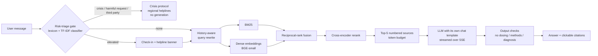

# MentalHealthRAG-Chatbot (v2)

A retrieval-augmented chatbot for **mental-health psychoeducation**. It answers questions from trusted sources
(mainly the UK charity [Mind](https://www.mind.org.uk/information-support/)) with inline citations, and it screens every
message with a **risk-triage safety gate** before retrieval. Crisis messages get a compassionate response with verified
regional helplines instead of a generated answer. It runs on a free CPU host, a laptop, or a GPU with any of about 30 open
or API LLMs.

> ⚠️ **Not a substitute for professional care.** This is a research prototype and information tool, not a medical
> device. It can be wrong, it cannot diagnose or treat, and it is not a crisis service. If you are in danger, contact
> your local emergency services. In India, call Tele-MANAS on 14416 or 1800-89-14416; in the US, call or text 988; in the UK,
> call Samaritans on 116 123. Sources for each number are in [configs/helplines.yaml](configs/helplines.yaml).

**Research write-up:** [paper/](paper/) (LaTeX, Elsevier template). **Deploying:** [DEPLOY.md](DEPLOY.md).
**What changed from v1:** [CHANGELOG.md](CHANGELOG.md) (45 bugs, each mapped to its fix).

---

## How it works



| Component | Implementation |
|---|---|
| Knowledge base | 133 PDFs (85 Mind web pages, 41 Mind booklets, 7 other web articles), a 98-question FAQ and 30 factual intents, giving about 2.4k chunks. Each chunk carries `source_file`, `title`, `section`, `url` and `source_type`. |
| Ingestion | pypdfium2, header/URL parsing, removal of Welsh and cross-page boilerplate, NFKC normalisation, heading-aware token chunking, MinHash near-duplicate removal |
| Index | Normalised numpy matrix (exact cosine) + BM25 (bm25s) + a manifest recording the embedder, prefixes and corpus hash |
| Retrieval | BM25, dense, hybrid RRF, cross-encoder reranking (MiniLM or BGE), with LRU caches |
| LLM backends | `hf` (GPU/MPS, 4-bit), `llamacpp` (GGUF, CPU/Metal), `ollama`, `openai_compatible` (Groq, OpenRouter, Together, HF router, vLLM, OpenAI), `mock` |
| Safety | A curated lexicon (with negation guard, third-party and method-request detection) plus a TF-IDF+LR classifier in two tiers; crisis templates; output checks |
| Server | FastAPI with SSE streaming, per-IP rate limiting, no message logging by default, and a refusal to start on a missing or mismatched index |
| UI | Plain HTML/CSS/JS with sanitised markdown (DOMPurify), citations, model selector, crisis banner, light/dark themes and accessible labels |

## Quickstart (local)

```bash
python3.11 -m venv .venv && source .venv/bin/activate
pip install -e ".[cpu,gpu,eval,dev]"            # or ".[cpu]" for a torch-free install
python -m scripts.build_index                   # ~30 s; skipped if nothing changed
python -m scripts.train_risk_classifier --skip-transformer   # ~1 min (TF-IDF gate model)
MHRAG_LLM__MODEL=qwen2.5-1.5b-gguf uvicorn server.app:app --port 8000
```
Open <http://localhost:8000>. Use `MHRAG_LLM__MODEL=mock` for an instant, download-free UI test. Set
`GROQ_API_KEY` to enable the API models, and switch models in the UI.

Docker: `docker compose up --build` serves the app on http://localhost:8000. Public deployment (Hugging Face Space, Render,
Railway): see [DEPLOY.md](DEPLOY.md).

## Configuration

All settings live in [configs/default.yaml](configs/default.yaml), and any of them can be overridden with
`MHRAG_<SECTION>__<KEY>`:

| Setting | Default | Example override |
|---|---|---|
| Embedder | `bge-small` | `MHRAG_INDEX__EMBEDDER=e5-base` (then rebuild the index) |
| Chunk size | 256 tokens | `MHRAG_CHUNKING__CHUNK_TOKENS=512` |
| Retrieval mode | `hybrid_rerank` | `MHRAG_RETRIEVAL__MODE=dense` |
| Default LLM | `qwen2.5-1.5b-gguf` | `MHRAG_LLM__MODEL=llama-3.3-70b-groq` or `auto` |
| Models in the UI selector | all (`["*"]`) | `MHRAG_LLM__SERVED_MODELS='["qwen2.5-1.5b-gguf","gpt2"]'` |
| Helpline region | `IN` | `MHRAG_SAFETY__REGION=UK` |
| Log message text | `false` | never enable in production |

**Switching models:** the UI's model selector lists the whole catalogue, grouped (API, llama.cpp, transformers, Ollama, and
the original v1 models). Every model this machine can run is selectable. The others are shown disabled with the reason:
missing API key, gated without `HF_TOKEN`, too large for this machine's RAM/VRAM, or no Ollama server running. Local models
download on first use and are loaded one at a time. To restrict the list, set
`MHRAG_LLM__SERVED_MODELS='["qwen2.5-1.5b-gguf","llama-3.3-70b-groq"]'`.

The model catalogue is in [configs/models.yaml](configs/models.yaml). It covers Mistral-7B (the v1 baseline) and
Ministral-8B; Llama-3.1/3.2; Qwen2.5/Qwen3; Gemma-2/3; Phi-3.5/4-mini; SmolLM2, TinyLlama, Granite, OLMo-2 and FLAN-T5; the
original v1 models (GPT-2, GPT-J-6B, BART-large-CNN) as baselines; ungated GGUF builds; MentaLLaMA-chat-7B as a
mental-health domain baseline; and Groq-hosted Llama-3.3-70B and gpt-oss models. IDs, gating and licences were checked
against the Hugging Face API.

## Results (all numbers from `results/`)

Every number below was produced by a script in this repository, and the output is saved in [results/](results/).

**Safety gate** (lexicon + TF-IDF, v2) on the **held-out** red-team set (90 prompts, committed before evaluation):
crisis recall **0.833**, escalation false-positive rate **0.100**, accuracy **0.767**
([results/safety_gate_v2_heldout.json](results/safety_gate_v2_heldout.json)). On the development set it was designed
against, the same gate scores 0.983, which shows how optimistic author-written evaluations are. Gate v1 on the held-out
set: recall 0.778, FPR 0.133.

**Risk classifier** (test split of `mental_health.csv`, n=2797)
([results/risk_classifier.json](results/risk_classifier.json)):

| Model | AUROC | Recall @ τ | Precision @ τ | Flags explicit KB crisis phrases | Flags venting |
|---|---|---|---|---|---|
| TF-IDF + LR | 0.978 | 0.937 | 0.910 | 0.845 | 0.671 |
| DistilRoBERTa (fine-tuned) | 0.992 | 0.955 | 0.969 | 0.247 | 0.022 |

**Latency** (Apple M4, 16 GB; Qwen2.5-1.5B-Instruct; 12 fixed questions; v2 includes the gate and hybrid+rerank retrieval)
([results/latency.json](results/latency.json)):

| Configuration | Time to first token (p50) | End-to-end (p50) | Tokens/s |
|---|---|---|---|
| v1 settings: fp32, CPU, no streaming | 79.4 s | 79.4 s | 3.4 |
| v2: llama.cpp Q4_K_M, CPU only | 5.6 s | 11.6 s | 24.6 |
| v2: llama.cpp Q4_K_M, Metal | 1.4 s | 7.5 s | 43.8 |

**Retrieval** (256-token chunks; nDCG@10 with 95% bootstrap CIs; [results/retrieval_main.json](results/retrieval_main.json)):

| System | HeadingQA (n=561) | SynthQA (n=189) | ParaphraseQA (n=58) |
|---|---|---|---|
| v1 configuration: dense MiniLM-L6 | 0.759 [0.734, 0.782] | 0.637 [0.586, 0.689] | 0.675 [0.572, 0.775] |
| BM25 | 0.797 [0.774, 0.820] | 0.746 [0.700, 0.792] | 0.631 [0.517, 0.745] |
| Hybrid RRF (BGE-small) | 0.850 [0.829, 0.868] | 0.799 [0.764, 0.834] | 0.716 [0.612, 0.817] |
| **Deployed: hybrid + MiniLM cross-encoder (BGE-small)** | **0.940** [0.928, 0.953] | 0.792 [0.755, 0.831] | 0.841 [0.757, 0.915] |
| Best on each set | 0.946 (hybrid + MiniLM-CE, MiniLM) | 0.830 (hybrid + BGE reranker, E5-base) | 0.858 (hybrid + MiniLM-CE, E5-base) |

Cross-encoder reranking gave the largest gains on HeadingQA and ParaphraseQA. On SynthQA, only the BGE reranker improved
on unreranked hybrid retrieval; the MiniLM cross-encoder did not (0.792 vs 0.799). After reranking, the differences
between the five embedders fall within the confidence intervals. On HeadingQA and SynthQA, every system in the table
beats the v1 configuration significantly (paired bootstrap, Holm-corrected). On ParaphraseQA (only 58 queries), the
reranked systems do, but unreranked hybrid retrieval and BM25 do not.

**Chunk size** (`results/retrieval_chunks.json`, Kaggle): 128-token chunks are clearly worse (best nDCG@10 on SynthQA
0.604 vs 0.805 at 256 tokens). 256 and 512 tokens are close: HeadingQA 0.946 at both; ParaphraseQA 0.858 vs 0.900
(n=58, overlapping CIs); SynthQA 0.805 vs 0.774. MiniLM is capped at its 256-token input, so its 512 column repeats 256.

**Local-model generation** (`results/generation_local.json`, Kaggle; FAQ-Gen, 98 questions): with the full pipeline,
Qwen2.5-1.5B's NLI faithfulness is 0.325 vs 0.141 with v1-style naive RAG, and it declines 0.72 of out-of-scope
questions (0.10 with naive RAG). The v1 models do not answer: GPT-2 declines 0.02 of out-of-scope questions, and
BART-large-CNN (a summariser) copies its input.

**Risk gate on ordinary questions** (`results/gate_escalation.json`): the gate sent 11 of the 98 informational FAQ-Gen
questions to the crisis protocol and 12 to the elevated tier, all triggered by the classifier (e.g. "Where can I go to
find therapy"). It fails safe, but replaces useful answers.

**Still to run on a GPU** (Kaggle notebook): CUDA latency, the full multi-LLM benchmark and the LLM judge. Their tables
in the paper show `TODO(run)` with the command until then.
The Kaggle notebook is resumable across 12-hour sessions: attach its previous output as an input and run it
again. Finished steps are skipped, and interrupted ones continue from their last saved answer.
To bring results back, download `mhrag_results.zip` from the notebook's Output tab and run
`python -m scripts.import_results ~/Downloads/mhrag_results.zip` (add `--dry-run` to preview). It imports only the
experiments that run finished, never replaces a local measurement with a pending one, and regenerates the paper tables
and numbers.
GPU-scale results (7–12B models, LLM judge) are marked `TODO(run)` until you run the Kaggle or Colab notebook.

## Reproducing every table

| What | Command | Output |
|---|---|---|
| Ingestion stats + index | `python -m scripts.build_index` | `results/ingest_stats.json` |
| Evaluation sets | `python -m scripts.make_eval_sets [--synth]` | `eval/data/*.jsonl`, `results/eval_sets.json` |
| Risk classifiers | `python -m scripts.train_risk_classifier` | `results/risk_classifier.json`, `paper/tables/risk_classifier*.tex` |
| Safety gate | `python -m scripts.eval_safety --tag v2_devset` and `--data eval/data/safety_prompts_heldout.jsonl --tag v2_heldout` | `results/safety_gate_*.json` |
| Latency | `python -m scripts.bench_latency --all` | `results/latency.json` |
| Retrieval | `python -m scripts.run_eval --config configs/experiments/retrieval_main.yaml`; chunk sizes: `retrieval_chunks.yaml` (Kaggle step `retrieval_chunks`) | `results/retrieval_*.json` |
| Generation (small local models) | `python -m scripts.run_eval --config configs/experiments/generation_local.yaml` (Kaggle step `generation_local`, or a laptop in about 2 h) | `results/generation_local.json` |
| Generation (GPU) | [notebooks/kaggle_experiments.ipynb](notebooks/kaggle_experiments.ipynb) (Kaggle, recommended: ~30 free GPU h/week) or [notebooks/colab_experiments.ipynb](notebooks/colab_experiments.ipynb) | `results/generation_gpu.json` |
| Paper numbers | `python -m scripts.paper_numbers` | `paper/numbers.tex`, `paper/tables/latency.tex` |
| Everything on CPU | `bash scripts/run_all_local.sh` | all of the above |
| Human evaluation | `python -m eval.human_eval.make_sheets --exp local`, then `python -m eval.human_eval.agreement --exp local` | `results/human_eval_*.json` |

Tests: `pytest` (offline; uses a mock LLM and a hand-built fixture corpus). Lint: `ruff check .`.

## Safety, limitations and ethics
- **Not clinically validated.** No clinician has evaluated the responses yet (the protocol is in [eval/human_eval/](eval/human_eval/)). Do not use it with patients or as a crisis service.
- **The safety gate misses some crises**, about 1 in 6 on held-out prompts (for example implicit preparation statements and some third-party disclosures), and it over-escalates some figurative language ("this traffic is killing me"). Crisis messages are never answered by the LLM, but a missed crisis is answered as a normal question with the helpline banner.
- **Classifier training data** is public Reddit-style posts with subreddit-derived labels and stopwords removed (including "not"). It transfers poorly to other datasets.
- **The knowledge base is UK- and North America-centric.** Helplines are region-selectable, but answers can mention UK services. Seven sources are non-clinical web articles, and they are tagged as such in citations.
- **Privacy.** The server never stores or logs message text by default, and conversation history stays in the browser tab.
- **Small models** sometimes omit citations or repeat text. Answers that reach the length cap are trimmed to a complete sentence and offer a **Continue** button.

## Data sources and licences
The code is MIT-licensed ([LICENSE](LICENSE)). **The MIT licence does not cover the data.**

| Data | Owner and licence | Use here |
|---|---|---|
| Mind information pages and booklets (PDFs in `data/raw_data.zip`) | © Mind. Used for non-commercial research with attribution. Originals: <https://www.mind.org.uk/information-support/> | Knowledge base (answers link to the original pages) |
| 7 web articles (Times of India reader blogs, varthana.com, Lawctopus, Voices of Youth, medindia.net, VIMS) | © their publishers | Knowledge base, tagged `web_article` |
| Mental Health FAQ for chatbots (Kaggle) | See the dataset page (source: NAMI and HereToHelp BC content) | Knowledge base; FAQ-Gen evaluation |
| KB.json / mentalhealth.json intents (Kaggle chatbot datasets) | See the dataset pages | Factual intents only; ParaphraseQA |
| CounselChat (`context_response_train.csv`; HF `Amod/mental_health_counseling_conversations`) | See the dataset card | Held-out Counsel-Gen references (not indexed by default) |
| Suicide-risk posts (`mental_health.csv`), Reddit depression, Dreaddit, Mental-Health-Twitter | See each dataset's terms (Dreaddit: Turcan & McKeown, 2019) | Risk-classifier training and cross-dataset tests only; never indexed |

The raw archive is kept in the repository for reproducibility. It is **not** uploaded to the public Space
(see `scripts/deploy_space.py`).

## Repository layout
```
mhrag/          package: config, ingest/, index/, retrieval/, llm/, safety/, prompts, pipeline, cache, runtime
server/app.py   FastAPI server (SSE)
web/            UI (HTML/CSS/JS, vendored marked + DOMPurify)
scripts/        build_index, train_risk_classifier, eval_safety, make_eval_sets, run_eval, bench_latency,
                paper_numbers, deploy_space, prefetch_models, run_all_local.sh
eval/           metrics, judges, datasets, reports, data/ (eval sets), human_eval/
configs/        default.yaml, models.yaml, helplines.yaml, experiments/*.yaml
tests/          offline pytest suite
notebooks/      kaggle_experiments.ipynb, colab_experiments.ipynb (GPU experiments)
paper/          main.tex, refs.bib (verified), tables/, numbers.tex, JOURNALS.md
results/        every number reported anywhere
```
